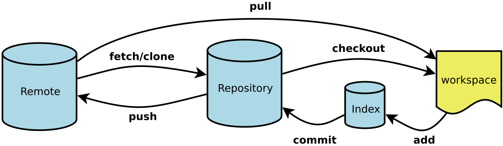

# 第1章 基础知识

## 1.1 代码提交步骤

初次时，本地执行如下代码

```shell
git init
git add README.md
git commit -m "first commit"
git branch -M master
git remote add origin git@github.com:github账号/Test.git
git push -u origin master
```

或者

```shell
git remote add origin git@github.com:github账号/Test.git
git branch -M master
git push -u origin master
```

## 1.2 多人协同开发



- 李华先克隆到本地

```shell
git clone 仓库网址
```

Git的基本概念
1. 仓库（Repository）：用于存储项目文件及其历史记录的地方。一个仓库可以包含多个分支。

2. 分支（Branch）：代表项目的不同版本或开发路径。通过创建分支，开发人员可以在不影响主分支的情况下进行工作。

3. 提交（Commit）：表示对项目文件的一组修改。每个提交都有一个唯一的标识符，并包含作者、时间戳以及提交的具体内容。

4. 合并（Merge）：将两个或多个分支的修改合并为一个统一的版本。Git会尝试自动合并修改，但可能需要处理冲突。

5. 远程仓库（Remote Repository）：存储在网络上的仓库，用于多个开发人员之间的协作。常见的远程仓库是GitHub和GitLab。

Git的使用方式包括：

1. 初始化仓库：使用git init命令在项目文件夹中创建一个新的Git仓库。

2. 添加文件：使用git add命令将文件添加到提交列表中。

3. 提交修改：使用git commit命令将提交列表中的修改保存到仓库中，并添加相关的描述信息。

4. 创建分支：使用git branch命令创建新的分支，或使用git checkout命令切换到已存在的分支。

5. 合并分支：使用git merge命令将一个分支的修改合并到另一个分支。

6. **拉取和推送：使用git pull命令从远程仓库拉取最新的修改，使用git push命令将本地的修改推送到远程仓库。**

7. 处理冲突：当合并分支时发生冲突时，需要手动解决冲突并提交修改。

8. 查看历史记录：使用git log命令查看提交历史，包括作者、时间戳和描述信息。

9. 协作开发：多个开发人员可以通过克隆远程仓库、创建分支、推送和合并修改等操作来协同工作。

Git 与 SVN 区别
Git 不仅仅是个版本控制系统，它也是个内容管理系统(CMS)，工作管理系统等。

如果你是一个具有使用 SVN 背景的人，你需要做一定的思想转换，来适应 Git 提供的一些概念和特征。

>- 1、Git 是分布式的，SVN 不是：这是 Git 和其它非分布式的版本控制系统，例如 SVN，CVS 等，最核心的区别。
>
>- 2、Git 把内容按元数据方式存储，而 SVN 是按文件：所有的资源控制系统都是把文件的元信息隐藏在一个类似 .svn、.cvs 等的文件夹里。
>
>- 3、Git 分支和 SVN 的分支不同：分支在 SVN 中一点都不特别，其实它就是版本库中的另外一个目录。
>
>- 4、Git 没有一个全局的版本号，而 SVN 有：目前为止这是跟 SVN 相比 Git 缺少的最大的一个特征。
>
>- 5、Git 的内容完整性要优于 SVN：Git 的内容存储使用的是 SHA-1 哈希算法。这能确保代码内容的完整性，确保在遇到磁盘故障和网络问题时降低对版本库的破坏。


